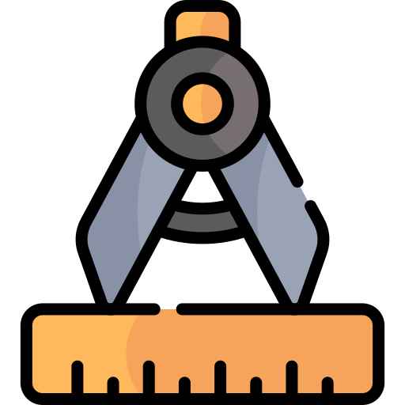

# ArchiVision Landing Page 

Este projeto é uma landing page para uma empresa de arquitetura, destacando projetos residenciais e comerciais.

Você pode visualizar a landing page em funcionamento [aqui](https://architecture-landing-page-x.netlify.app/).

## Visão Geral

ArchiVision é uma landing page desenvolvida para destacar a experiência e os serviços de uma empresa de arquitetura. O design é focado em transmitir tradição e modernidade, combinando elementos visuais que refletem a sofisticação e a confiança da marca.

## Tecnologias Utilizadas

- HTML5
- CSS3
- JavaScript

## Conceitos Aplicados

- **Responsive Design:** Utilização de media queries para garantir que a página seja responsiva em diferentes dispositivos e tamanhos de tela.
  
- **CSS Grid:** Layout da seção de menu utilizando CSS Grid para organização em colunas automáticas.
  
- **Contadores Animados:** JavaScript foi utilizado para criar contadores animados que mostram estatísticas dinâmicas sobre a empresa.

## Conteúdo do Projeto

- **Header:** Apresenta o nome da empresa e uma breve descrição de seus serviços.
  
- **Menu Estatístico:** Exibe estatísticas chave da empresa, como número de empreendimentos construídos, anos de experiência e área total construída.
  
- **Seção de Conteúdo:** Destaca a história e experiência da empresa, com um fundo visualmente atraente.
  
- **Formulário de Contato:** Permite que os visitantes entrem em contato com a empresa diretamente através do site.

## Ferramentas Utilizadas

- **Sheet Monkey:** Integrado ao formulário de contato para captura de dados diretamente no Google Sheets.
